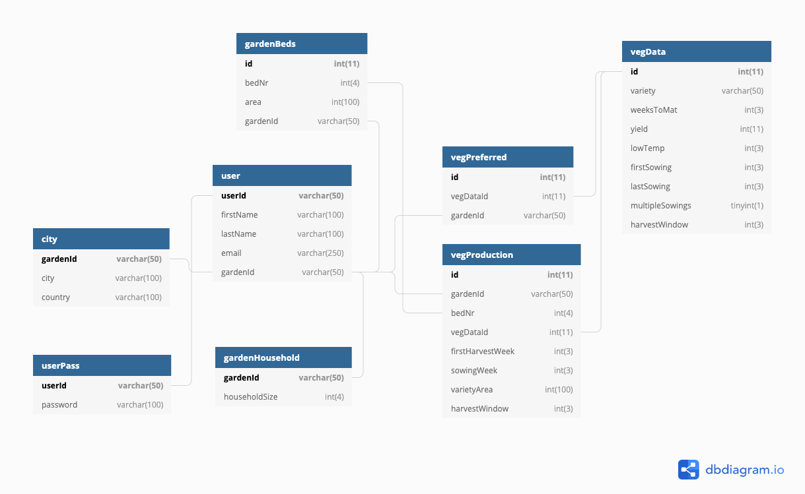

#Garten App 
an automatic vegetable garden planner

##Table of Contents

* [Summary](#Summary)
* [Functionality](#Functionality)
* [Technologies](#Technologies)
* [Code Examples](#Code Examples)
    * [MVC Methodology](#MVC Methodology)
    * [Garden Calculation](#Garden Calculation)
    * [API Communication](#API Communication)
* [Database Diagram](#Database Diagram)
* [Status](#Status)

###Summary
This is a vegetable garden planning tool, used to generate garden plans based on user input.
User information such as growing space available, preferred vegetable varieties, and household size are converted 
into a workable garden plan, through the use of general varietal data. Location information is used to collect weather data, 
which enables climate specific planning (feature still in development). 

Everyone should be able to get exercise and eat healthier by working in a garden to grow a bit of their own veg. 
This App aims to assist people in doing so.

###Installation
Once downloaded, the App needs to be configure for the local environment. 

* In app/Core/View the variable $rootpath needs to be adjusted to the local rootpath. 
* The Database.sql file needs to be set up on your server's database.
* In app/Models/Database the variables $host, $username, $password, $dbName need to be changed accordingly for the local database connection.

###Functionality
The app design uses Model View Controller and Object Oriented Programming methodology. Users inform themselves about the app
in the unprotected pages "Home" and "Über Uns"(About Us). Here there are multiple possibilities to register for and log in to the App.
Logging in gives users access to the protected pages "Dashboard", "Anbauplan"(Production Plan), and Ernteplan(Harvest Plan) as well
as the user and garden profiles. User input is mainly collected during an initial registration process, upon completion of which the 
garden plan is generated. This input can be changed through the profile interfaces, after which the garden plan is regenerated with the updated input. 

The garden plan is then displayed in various overviews. The Kulturenübersicht(variety overview) shows all the varieties to be 
grown and respective information about these. The Beetübersicht(bed overview) shows the different garden beds, their area, and which 
varieties are to be grown in them. The Anbauübersicht(production overview) shows what is to be sown where, and the 
Ernteübersicht(harvest over view) shows what is to be harvested when. The user should navigate the garden year by using these overviews
to plan their work in the garden each week. Future functionality still in development will expand the App by a "To Do" interface, 
which will list tasks to be completed in the garden in week, month, and year format in order to simplify the garden work planning process.

A Wetterübersicht(weather overview) utilizes information from the openweathermap.org api to generate a daily forecast for the
user's location. Future functionality here will utilize climate information to plan the garden year accordingly. 

###Technologies
All this is accomplished through the use of php, html, css, javascript, and mySQL. The user interfaces are built with a 
custom adaptation of the bootstrap framework from https://getbootstrap.com/. Interactivity and communication is facilitated 
through the use of the jquery framework from https://jquery.com/. Back-end functionality is implemented with php 7.4.9 
from https://www.php.net/. Communication with the database uses the PDO class https://www.php.net/manual/en/class.pdo.php.
The openweathermap.org api https://openweathermap.org/api is utilized to retrieve weather data. The communication with the 
api is carried out using the PHP HTTP client Guzzle https://github.com/guzzle. Composer https://getcomposer.org/
is used to simplify the process of including and requiring classes throughout the App.

###Code Examples
####MVC Methodology
The use of MVC methodology allows for added security in the server-side areas of the app, this in combination with OOP techniques
provide a simplified separation of concerns throughout the project. URL requests in public/index.php are handled through a router in the App.php class, here they are 
converted into paths, controllers, methods and parameters as applicable.`

```
     private $controller = "App\Controllers\HomeController";
     private $method = "index";
     private $params;
     
     // Convert requested url into controller namespace, class, method, and parameters as applicable
     public function __construct()
     {
         $url = $this->parseUrl();
 
         if (isset($url)) {
             $requestedController = 'App\Controllers\\' . ucfirst($url[0]) . 'Controller';
             if (isset($url[1])) {
                 if (class_exists('App\Controllers\\' . ucfirst($url[0]) . '\\' . ucfirst($url[1]) . 'Controller')) {
                     $namespace = 'App\Controllers\\' . ucfirst($url[0]);
                     $requestedController = $namespace . '\\' . ucfirst($url[1]) . 'Controller';
                     unset($url[1]);
                 }
             }
             unset($url[0]);
         }
 
         if (isset($requestedController)) {
             if (class_exists($requestedController)) {
                 $this->controller = $requestedController;
                 unset($url[0]);
             }
         }
 
         if (isset($url[1]) && method_exists($this->controller, $url[1])) {
             $this->method = $url[1];
             unset($url[1]);
         }
 
         $this->params = $url ? array_values($url) : [];
 
         // call controller, method and parameters
         $controller = new $this->controller;
         $params = $this->params;
         $method = $this->method;
 
         $controller->$method($params);
     }
 
     // Convert url into assoc. array
     private function parseUrl()
     {
         if (isset($_GET['url'])) {
             return explode('/', filter_var(rtrim($_GET['url'], '/'), FILTER_SANITIZE_URL));
         } else {
             return null;
         }
     }
```

The controller, method and parameters are then called. In the controller requested views are rendered through the view class.

```
     public function index($params)
     {
         session_destroy();
         session_start();
         $this->view->render("home", $params);
     }
```

Class View:

```
// Renders views with applicable parameters as called by controllers
class View
{   
    // Renders requested view with applicable data variables
    public function render($view, array $data = [])
    {
        $rootpath = $this->rootpath;

        require_once ("../app/Views/partials/header.php");
        require_once ("../app/Views/modules/" . $view . ".php");
        require_once ("../app/Views/partials/footer.php");

        exit;
    }

    // Renders requested partial view with applicable data variables
    public function renderPartial($path, array $params = [], array $data = [])
    {
        require_once ("../app/Views/partials/" . $path . "/" . $params[0] . ".php");

        exit;
    }
}
```
In this case the view home.php is finally displayed in the user's browser with the appropriate header and footer.

Controllers also access Models to communicate with the database and api, or to carry out necessary computations within the App.
This excerpt from the Bed Model shows the method which, when called by a POST request from the addbed() method in reg-modals.js, adds beds to the database.

addBed from reg-modals.js:

```
function addBed(isUpdate) {
    hideAlerts();
    console.log('add bed');
    let bedNr = $('#ip-gardenBeds__bedNr');
    let length = $('#ip-gardenBeds__length');
    let width = $('#ip-gardenBeds__width');
    let area;

    // Import validation class
    import(window.rootpath + "js/Vali.js")
        .then((module) => {
            const validate = new module.Vali();
            if (validate.validateNumber(bedNr.val())) {
                bedNr.removeClass('border-danger');
                if(validate.validateNumber(length.val())) {
                    length.removeClass('border.danger');
                    if(validate.validateNumber(width.val())) {
                        width.removeClass('border-danger');
                        area = (length.val() * width.val());
                        // Send data on for further processing
                        $.ajax({
                            url: window.rootpath + 'bed',
                            type: 'post',
                            async: true,
                            data: {
                                "func": "addBed",
                                "bedNr": bedNr.val(),
                                "area": area
                            }
                        }).done(function (feedback)
                        {
                            console.log(feedback);
                            if (feedback == 1) {
                                hideAlerts();
                                bedNr.removeClass('border-danger');
                                $('#bed-overview-wrap').removeClass('d-none');
                                loadOverview('bed-overview', '.garden-bed-overview');
                                if (!isUpdate) {
                                    // Bed added, give possibility to complete registration
                                    showAlert('4', 'Gartenbeet ' + bedNr.val() + ' wurde erfolgreich hinzugefügt. Fügen Sie noch mehr Beete hinzu, oder <a href="#" class="text-primary" onclick="loadModal(\'welcome\')">schließen Sie die Registrierung ab.</a>');
                                } else if (isUpdate) {
                                    // Bed added
                                    showAlert('4', 'Gartenbeet ' + bedNr.val() + ' wurde erfolgreich hinzugefügt.');
                                    $('#addBedCard').removeClass('show');
                                }
                            } else {
                                hideAlerts();
                                showAlert('2', 'Beetnummer wird schon benutzt, bitte wählen Sie eine andere Nummer.');
                                bedNr.addClass('border-danger');
                            }
                        });

                    } else {
                        width.addClass('border-danger');
                        showAlert('3', 'Bitte vervollständigen Sie Ihre Angaben.')
                    }
                } else {
                    length.addClass('border-danger');
                    showAlert('3', 'Bitte vervollständigen Sie Ihre Angaben.')
                }
            } else {
                bedNr.addClass('border-danger');
                showAlert('3', 'Bitte vervollständigen Sie Ihre Angaben.')
            }
        });
}
```

Bed Model:
```
    public function addBed($data) {
        $bedNr = $data['bedNr'];
        $area = $data['area'];

        $validate = new Vali();
        if ($validate->validateInt($bedNr) == 1 && strlen(strval($bedNr)) <= 4) {
            if ($validate->validateInt($area) == 1 && strlen(strval($area)) <= 100) {
                $registerBed = new Database();
                $checkBedNr = new Database();
                $result = $checkBedNr->queryStatement("SELECT * FROM gardenBeds WHERE gardenId = ? AND bedNr = ?", [$this->gardenId, $bedNr]);
                if ($result->count() < 1) {
                    $registerBed->query("INSERT INTO gardenBeds (gardenId, bedNr, area) VALUES (?,?,?)", [$this->gardenId, $bedNr, $area]);
                    return 1;
                }
            }
        }

        return 0;
    }
    
```

####Garden Calculation
The Garden Model handles all necessary database communication and calculations pertaining to the garden. This calculateVegProduction
method generates the garden plan from user input tables, and is thus the crux of the App's functionality.

```
public function calculateVegProduction()
     {
         $this->deleteVegProductionData();
 
         $beds = $this->getBeds();
         $gardenVarieties = $this->getGardenVarietes();
         $householdSize = $this->getHouseholdSize();
         $bed = 0;
         $totalSowings = [];
         $sowing = 0;
         $bedArea = $beds[$bed]['area'];
         foreach ($gardenVarieties as $variety) {
             array_push($totalSowings, $variety->getTotalSowings());
         }
 
         // Plan available beds with varieties successively until all beds are filled, or all varieties have been planned
         while ($bed < count($beds) && $sowing < max($totalSowings)) {
             // Go through all varieties for every sowing
             foreach ($gardenVarieties as $variety) {
                 // Check if sowing is needed for variety, if so calculate first harvest week, sowing week and variety area for variety
                 if ($sowing < $variety->getTotalSowings()) {
                     $firstHarvest = $variety->getFirstHarvest() + ($sowing * $variety->getHarvestWindow());
                     $sowingWeek = $variety->getFirstSowing() + ($sowing * $variety->getHarvestWindow());
                     $varietyArea = ($variety->getQcmPerServing() * $householdSize) * $variety->getHarvestWindow();
                     $vegProductionEntry = new Database();
                     // Fill beds with variety until needed area has been accounted for, move to next bed as needed
                     if ($bedArea > $varietyArea && isset($beds[$bed]['bedNr'])) {
                         $vegProductionEntry->query("INSERT INTO vegProduction (gardenId, bedNr, vegDataId, firstHarvestWeek, sowingWeek, varietyArea, harvestWindow)
                                                         VALUE (?,?,?,?,?,?,?)", [$this->gardenId, $beds[$bed]['bedNr'], $variety->getVegDataId(), $firstHarvest, $sowingWeek, $varietyArea, $variety->getHarvestWindow()]);
                         $bedArea -= $varietyArea;
                     } else {
                         while ($varietyArea > 0 && isset($beds[$bed]['bedNr'])) {
                             $vegProductionEntry->query("INSERT INTO vegProduction (gardenId, bedNr, vegDataId, firstHarvestWeek, sowingWeek, varietyArea, harvestWindow)
                                                             VALUE (?,?,?,?,?,?,?)", [$this->gardenId, $beds[$bed]['bedNr'], $variety->getVegDataId(), $firstHarvest, $sowingWeek, $bedArea, $variety->getHarvestWindow()]);
                             $varietyArea -= $bedArea;
                             $bed++;
                             if (isset($beds[$bed]['area'])) {
                                 $bedArea = $beds[$bed]['area'];
                                 if ($bedArea > $varietyArea) {
                                     $vegProductionEntry->query("INSERT INTO vegProduction (gardenId, bedNr, vegDataId, firstHarvestWeek, sowingWeek, varietyArea, harvestWindow)
                                                             VALUE (?,?,?,?,?,?,?)", [$this->gardenId, $beds[$bed]['bedNr'], $variety->getVegDataId(), $firstHarvest, $sowingWeek, $varietyArea, $variety->getHarvestWindow()]);
                                     $bedArea -= $varietyArea;
                                     $varietyArea = 0;
                                 }
                             } else if(!isset($beds[$bed]['area'])){
                                 $varietyArea = 0;
                             }
                         }
                     }
                 }
             }
             $sowing++;
         }
     }
```
####API Communication
API data and various internal data and files can be called through the Controllers/Src/ directory Controllers using parameters to 
specify which data or file should be rendered in what manner. This achieved through a combination of javascript and php. 
Api communication with the openweathermap.org api occurs through the PHP HTTP client Guzzle https://github.com/guzzle. 
Calls to the Weather model are generated in the OverviewController conditional upon the passing of the parameter "weather-overview"
to the controller from a javascript GET request in overviews.js on the client side.

Overviews.js:
```
// Load overview content on events
   $('.garden-bed-overview').on('load', loadOverview('bed-overview', '.garden-bed-overview'));
   $('.variety-overview').on('load', loadOverview('variety-overview', '.variety-overview'));
   $('.production-overview').on('load', loadOverview('production-overview', '.production-overview'));
   $('.harvest-overview').on('load', loadOverview('harvest-overview', '.harvest-overview'));
   $('.weather-overview').on('load', loadOverview('weather-overview', '.weather-overview'));
   $('#dash__wetter-ip').on('input', ()=>$('#dash__wetter-btn').removeClass('d-none'));
   $('#dash__wetter-btn').on('click', ()=>{
       loadOverview('weather-overview/' + $('#dash__wetter-ip').val(), '.weather-overview');
       $('#dash__wetter-btn').addClass('d-none');
   });
   
   // Loads overview into element
   function loadOverview(overview, element) {
       $(element).html('');
       $.get(window.rootpath + "src/overview/" + overview, function(data){
           $(element).html(data);
       });
   }
```

OverviewController method:

```
// Renders data from openweathermap.org api, or returns an error message if an exception occurs
           if($params[0] == "weather-overview") {
               if(isset($params[1])) {
                   $newCity = ucfirst(htmlspecialchars($params[1]));
                   $weather = new Weather($newCity);
                   $weatherData = json_decode($weather->getWeatherData(), true);
               } else {
                   $weather = new Weather();
                   $weatherData = json_decode($weather->getWeatherData(), true);
               }
               if(isset($weatherData['exception'])) {
                   echo "Wetterdata zu Ihrem Standort könnte nicht gefunden werden.";
                   exit;
               }
               $this->view->renderPartial("overviews", $params, $weatherData);
           }
```

Weather Model:

```
// Retrieves weather data from openweathermap.org api
   class Weather
   {
       // http://api.openweathermap.org/data/2.5/weather?id={city id}&appid={your api key}
       private $url = "http://api.openweathermap.org/data/2.5/weather?";
       private $apiKey = "ccc468a6efa8437dc081b82b4aa20e47";
       private $cityName;
   
       public function __construct($newCity = "")
       {
           if(!empty($newCity)) {
               $this->cityName = $newCity;
           } else {
               $user = new User();
               $this->cityName = $user->getUserCity();
           }
       }
   
       // Return weather data assoc. array or exception message
       public function getWeatherData()
       {
           // Adapted from https://github.com/guzzle/guzzle for api requests
           $client = new \GuzzleHttp\Client();
           try {
               $response = $client->request('GET', $this->url . "q={$this->cityName}" . "&appid={$this->apiKey}" . "&lang=de");
           } catch (Exception $e) {
               return json_encode(["exception" => $e->getMessage()]);
           }
   
           //echo $response->getStatusCode(); // 200
           //echo $response->getHeaderLine('content-type'); // 'application/json; charset=utf8'
           return (string) $response->getBody();
       }
   }
```

###Database Diagram
The following diagram exhibits the Database structure for the App.


###Status
This App is still in development. To meet the deadline of the Summative Assignment, I decided to cut development of 
several aspects short in this version. Text for all interfaces needs to be completed, as well as a much more extensive varietal 
selection in the vegData table. The planned Task model and correlating controller and views will enhance the practical 
usability for garden planning in the next version. The development of climate specific locational planning, crop 
rotation based planning, market garden scale customer interfaces, customer management tools, and financial management tools
are just a couple of features planned for further versions after that. 


    

